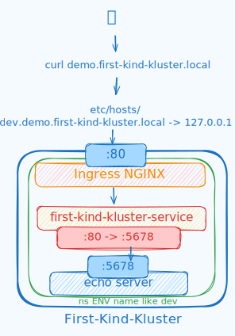

# Local K8s Ingress demo with Kind

## Intro

Practice repository to learn basic kubernetes with:
- Namespaces
- Services
- Ingress routing (Nginx controller)

## What it does

1. Spin up a kubernetes cluster with kind (kubernetes in docker locally)
2. Creates a namespace
3. Make a simple http-echo server app that returns a simple message, in the namespace we made
4. Creates a service for the app with port mappings between ingress and the server we made
5. Configures an ingress controller (Nginx) to route traffic to the service we made

## Diagram

